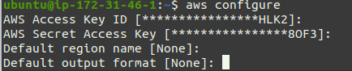
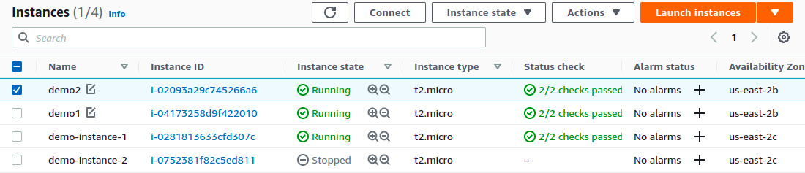
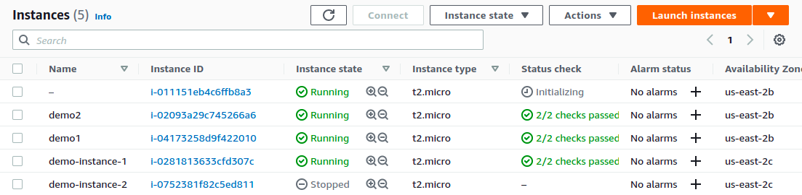
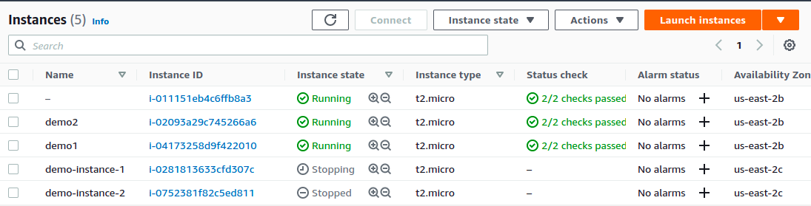

# Create and Stop Instances on AWS using Boto3

---

## Short Description 

This template will you the flavour of boto3 where you will be able to create and stop the instances using boto3 without using UI of AWS.

---
### Commands 

`python3 filename.py`

#### Note : To configure AWS IAM User

`sudo apt install awscli`

Then configure using , `aws configure`

Find you AWS Access KEY and Secret in your AWS account 

---
### Steps to Kick Start

First , create an Instance using boto3, before the instance present 

`create-instance-boto3.py`

Instance is created using Boto3,

`stop-instance-boto3.py`

List after the Instance is Stop file called,

