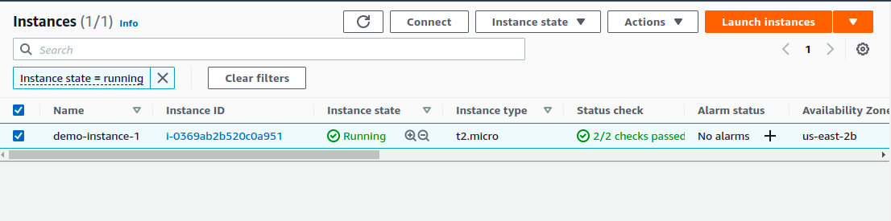
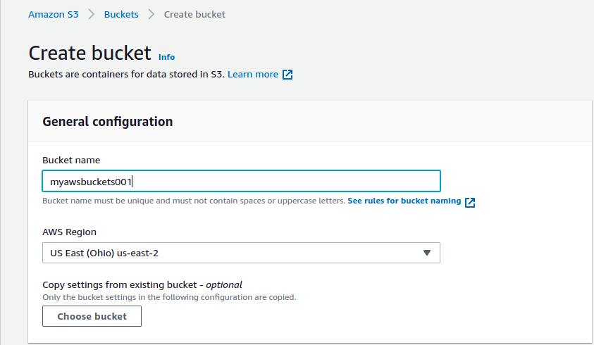
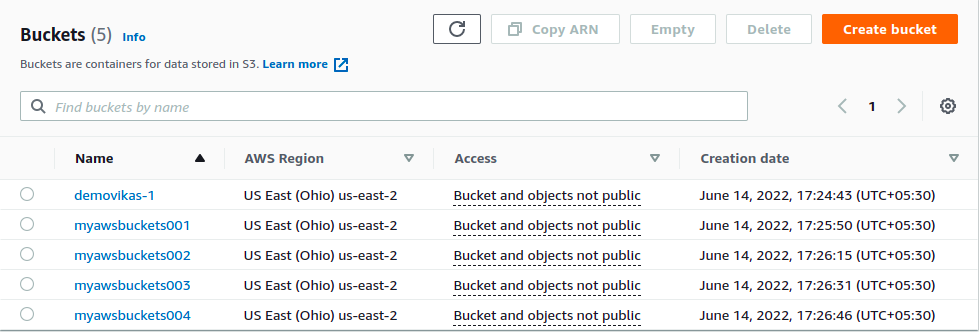
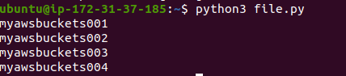

# Using Boto3 on AWS display the Buckets list

## Short Description 

This template will you the flavour of boto3 where you will find how to get the names or list of buckets and EC2 instances without using UI of AWS. 

## Getting Started with Installation

* Install python
* Install pip

### Commands 

`sudo apt-get update`

`sudo apt-get install python3 -y`

`sudo apt-get install ansible -y`

`sudo apt-get -y install python3-pip`

`pip3 --version`

#### Note : To configure AWS IAM User

`sudo apt install awscli`

Then configure using , `aws configure`

Find you AWS Access KEY and Secret in your AWS account 

### Steps to Kick Start

First , create an Instance on AWS

Create some S3 bucket 

Name the bucket 

Run the *file.py* file using the command

`python3 file.py`

It will provide you with the list of buckets.

`listing_EC2_Instances`

It will provide you with the list of EC2 instances.

#### OUTPUT

